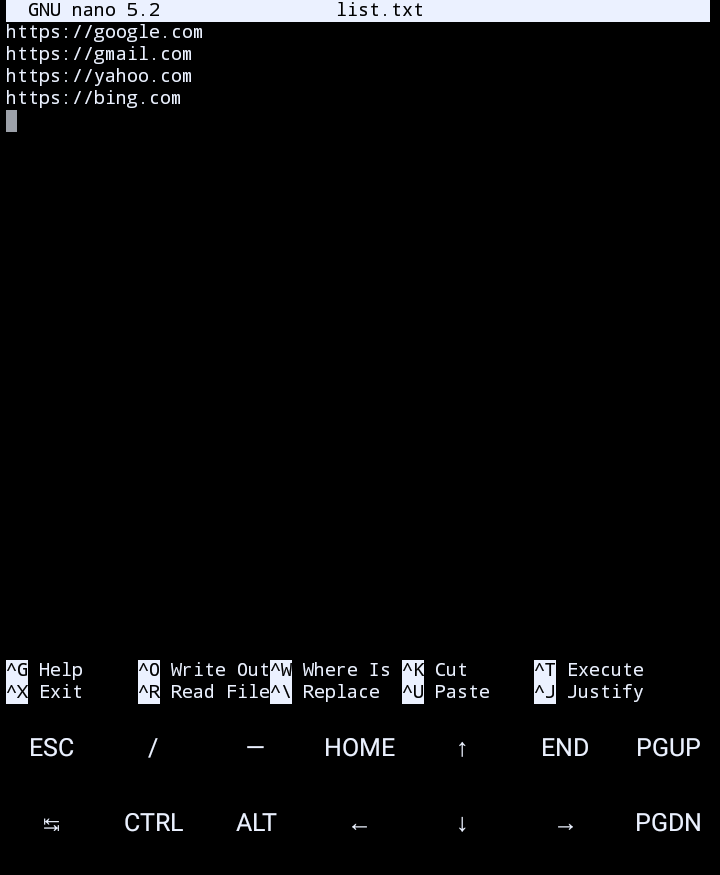
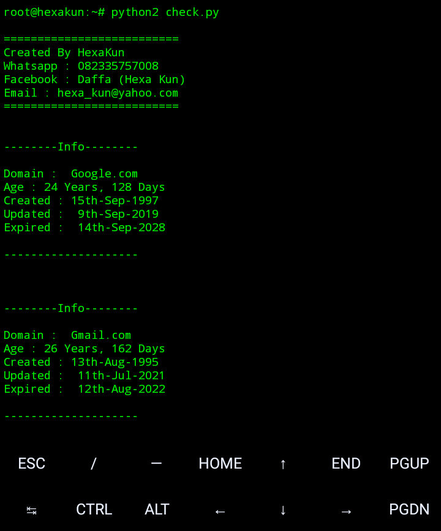
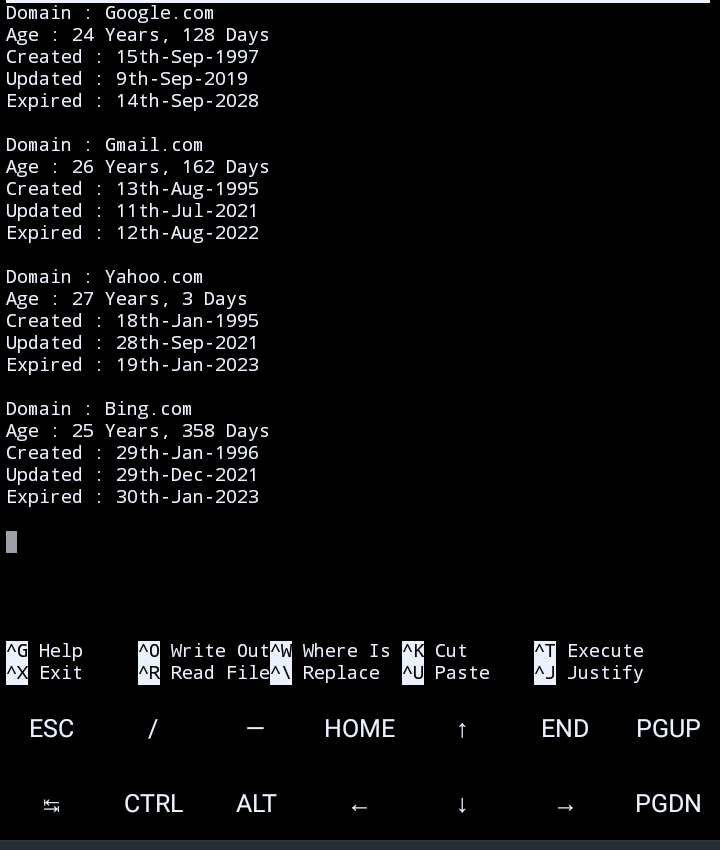

## Info
***
- 1. This tool is no longer being developed.
- 2. This tool can be used by anyone and this tool is open source.
## How To Use
***
- $ apt install python2
- $ pip2 install requests
- $ pip2 install bs4
- $ python2 check.py
## Screenshot
***
List

Run

Result Saves in finish.txt

## Thanks to all suport
- I really thank you for supporting me, Have a nice day
